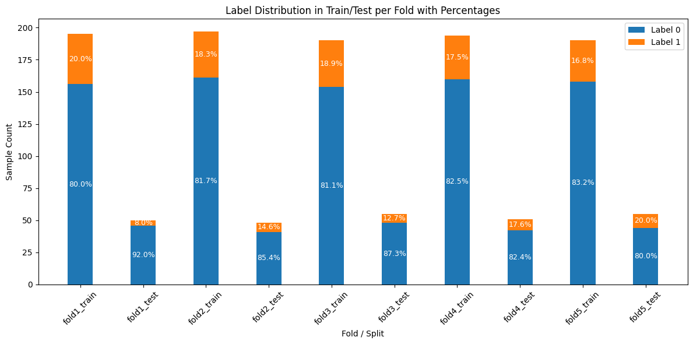
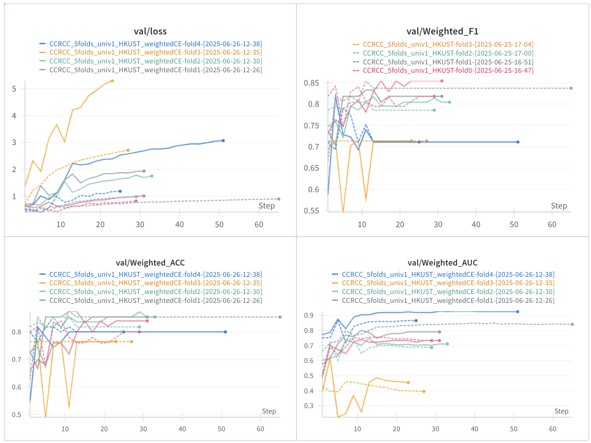

# Dataset
**Image:** TCIA CCRCC WSIs from [TCIA Cancer Imaging Archive](https://www.cancerimagingarchive.net/collection/cptac-ccrcc/), 245 cases in total

**Split:** Using the first 5 folds of [data split](https://huggingface.co/datasets/MahmoodLab/Patho-Bench/blob/main/cptac_ccrcc/BAP1_mutation/k%3Dall.tsv) provided by [Patho-Bench](https://github.com/mahmoodlab/Patho-Bench) from [Mahmood Lab](https://faisal.ai/). csv file located at `downstream_task/diagnosis_preidction/dataset_csv/CCRCC_5folds.csv`

**Task:** BAP1 mutation prediction



# Tissue Segmentation and Patching
Using the [Trident](https://github.com/mahmoodlab/TRIDENT?tab=readme-ov-file) framework from [Mahmood Lab](https://faisal.ai/). 
Environment Preparation
```bash
conda create -n "trident" python=3.10
conda activate trident
git clone https://github.com/mahmoodlab/trident.git && cd trident
pip install -e .
```
Run
```bash
cd ..
bash feature_extraction_CCRCC_univ1.sh
```
Patching coordinates obtained are in .h5 format with the following structure structure: 
```
<Encoder_name> 
└── <mag>px_<patch_size>px_0px_overlap 
	└── patches 
		├── file1_patches.h5 
		├── file2_patches.h5 
		└── ...
```
The default `mag` and `patch_size` parameters provided by the Trident framework are used.

# Feature Extraction
uni model was downloaded from [huggingface](https://huggingface.co/MahmoodLab/UNI) and placed at `Feature_extract/models/ckpts/uni.bin`
Run
```bash
conda activate mSTAR
cd Feature_extract
bash CCRCC.sh
```
# ABMIL Training
Run
```bash
cd downstream_task/diagnosis_prediction
bash CCRCC_weightedCE.sh
```
Loss and metrics are logged with weights and biases.

same color represents the results from the same fold. dashed line: naive CE loss; solid line: weighted CE loss
# Code Modifications: 
#### Using Trident feature
- new args: `--encoder_pipeline`. By default is set to `HKUST`, which is the orginal mSTAR implementation. Can also pass the value `Trident` to run ABMIL on features extracted by Trident (stored in `.h5` format).
- `Dataset_Subtyping`: takes `encoder_pipeline`
	- added code to get `self.n_features` from h5 feature files in `__init__`
	- added code to get `Slide` (feature tensor) from h5 feature files in `__getitem__` 
#### Weighted CE Loss
- Optionally using weighted CE loss instead of naive CE loss to account for class imbalance. controlled with arg `--loss weighted_ce`
- added `get_class_weightes(self, train_indicies)` function in class `Dataset_Subtyping`, returns the `class_weights` tensor calculated from train split using `compute_class_weight` from scikit-learn.
- added `weighted_ce` option in `utils/loss.py/define_loss` to return weighted CE loss as the criterion 
